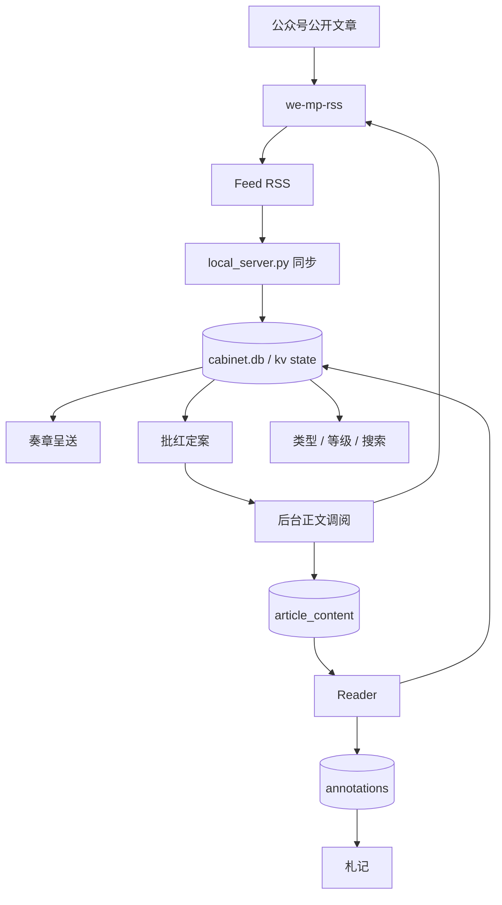

# 系统架构

## Tech Stack

### 21世纪内阁主站

- UI：原生 HTML、CSS、JavaScript。
- 静态入口：`dist/index.html`。
- 阅读与批注增强：`dist/reader-features.js`、`dist/reader-features.css`。
- 本机服务：Python `ThreadingHTTPServer`，入口为 `local_server.py`。
- 数据库：Python `sqlite3` + SQLite。
- Feed：`urllib.request` + `xml.etree.ElementTree`。
- 并发：`threading` + `ThreadPoolExecutor(max_workers=2)`。
- 状态：浏览器内存状态与服务端 SQLite 同步；离线演示模式回退到 `localStorage`。

仓库中的 Next.js、Vinext、Drizzle、Cloudflare 配置来自早期 Sites 脚手架。当前本机 V1.0 不通过这些组件运行。

### 公众号采集器

- 上游项目：`we-mp-rss` 1.5.3，本机维护独立分支。
- 后端：Python、FastAPI、SQLAlchemy。
- 前端：Vue 3、Vite、Arco Design。
- 数据库：SQLite，亦保留上游的 MySQL 兼容能力。
- 正文采集：Playwright/浏览器采集与 API 模式回退。
- 定时任务：项目自带 scheduler，并增加内阁低频维护任务。

## Directory Structure

```text
21世纪内阁/
├─ site/                         # 主站 Git 仓库
│  ├─ dist/                      # 实际前端源码与启动页图片
│  ├─ data/                      # cabinet.db、备份和私人导入导出；Git 忽略
│  ├─ docs/                      # V1 交接文档
│  ├─ local_server.py            # API、同步、SQLite 和静态服务
│  ├─ 启动21世纪内阁.cmd
│  └─ 启动公众号采集器.cmd
└─ we-mp-rss/                    # 公众号采集器及内阁集成改动
   ├─ apis/                      # FastAPI 接口
   ├─ core/                      # 数据、采集、RSS 和公共逻辑
   ├─ jobs/                      # 同步与维护任务
   ├─ web_ui/                    # Vue 源码
   ├─ static/                    # 采集器已构建前端
   └─ data/                      # 私有配置、SQLite、授权与缓存；Git 忽略
```

公开发行版以根目录作为单一 Git 仓库；两个子目录保持同级，以满足本机运行时的相对路径约定。

## Core Modules

### Source

来源保存在 `cabinet.db` 的 `kv.state.sources` JSON 中。负责名称、Feed URL、等级、类型、同步启停、默认批红规则及同步状态。

### Article

文章索引和用户状态保存在 `kv.state.articles`。正文不放在该 JSON 中，而是按需存入 `article_content` 表。

### Feed Sync

`CabinetStore._sync()` 选择到期且启用的来源，按 A、B、C 优先级排序，最多并行同步两个 Feed。去重优先使用 URL，缺失时回退到“来源 ID + 标题”。

### 奏章呈送

实际语义是“全部未读”，不是自然日 Today。先按发布日期倒序，再在同一天内按 A、B、C 排序。用户可在这里用勾选框设置单篇批红覆盖。

### 批红定案

显示未读且 `articleInInbox(article)` 为真的文章。该函数先读取文章级 `manualInbox` 覆盖；没有覆盖时使用来源 `inbox && enabled`。

### Reader

首次打开未缓存文章只触发后台调阅，不弹出阅读器。正文就绪后再次打开进入站内 Reader。失败文章直接提供原文链接。

### Saved / Continue / Notes

- Saved：`saved === true`。
- Continue：`0 < progress < 0.95`，不受批红规则限制。
- Notes：读取 `annotations` 表并按文章归组。

### Search / Filter

搜索覆盖标题、摘要和来源名称。当前文章列表筛选支持全部、未读、已收藏及 A/B/C；类型和等级也可以从侧栏进入独立视图。

## Data Flow



采集器完成一轮更新后会调用 `http://127.0.0.1:4173/api/collector-updated`。主站对通知进行约 12 秒防抖，然后读取最新 RSS。

## Important Design Decisions

### Tier 与批红解耦

```text
tier = 来源整体重要性与同步优先级
inbox = 来源新未读文章是否默认进入批红
```

Tier 不直接决定批红资格。

### Enabled 与 Inbox 解耦

```text
enabled = false
→ 停止该来源后续同步

inbox = false
→ 继续同步，但新文章默认不进入批红
```

### 单篇覆盖

`manualInbox` 是三态字段：

- `true`：单篇加入批红；
- `false`：单篇移出批红；
- 缺失：继承来源规则。

这是根据 V1.0 后期真实需求加入的设计，明确不同于最初“Article 不保存 Inbox 状态”的计划。

### Saved / Continue 与批红解耦

任何来源文章都可以阅读、收藏、继续阅读、搜索和添加札记。

### Local-first

主服务只绑定 `127.0.0.1`。没有用户系统，也不面向局域网或公网。敏感授权与数据留在本机被 Git 忽略的目录中。

## Implementation Pitfalls

1. `reader-features.js` 会在加载后覆盖 `pageInfo`、`nav`、`articleCard`、`render`、`openReader` 和 `closeReader`。修改文章卡片或 Reader 时必须检查最终覆盖层，否则主文件的变化会被重新覆盖。
2. `dist/` 是实际源码，不是可随意删除的构建产物。
3. `local_server.py` 假定采集器位于同级 `../we-mp-rss`。
4. 主站 `package.json` 保留早期 Sites 脚手架依赖；本机运行方式以仓库根 README 和启动脚本为准。
5. 静态托管版本没有 Python/SQLite API，只能进入浏览器演示模式。
